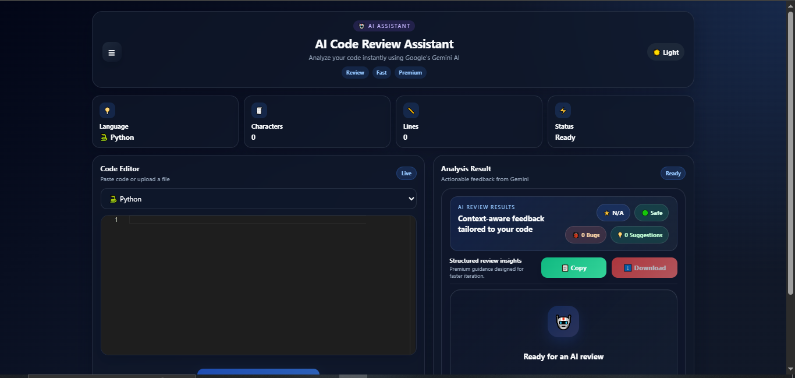
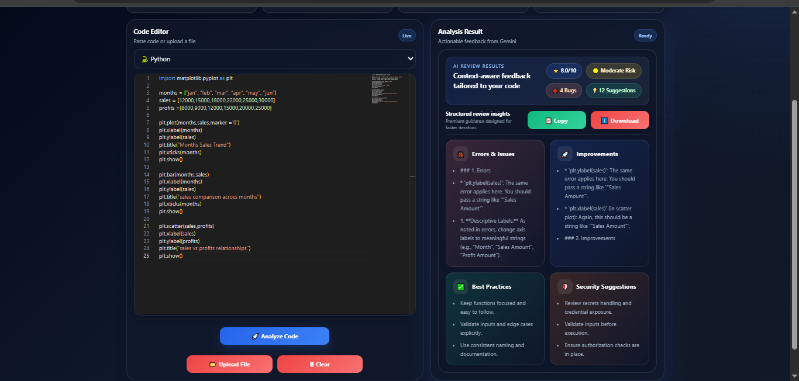

# 🤖 AI Code Review Assistant

An AI-powered code review application that analyzes source code and provides intelligent suggestions, bug detection, best practices, and improvement recommendations using Google's Gemini AI.

## 🚀 Features

- AI-powered code analysis using Gemini AI
- Multi-language support
  - Python
  - Java
  - JavaScript
  - C++
- File upload with automatic language detection
- Review history sidebar
- Copy review to clipboard
- Download review as PDF
- Dark and Light mode support
- Responsive premium UI
- Custom AI branding and logo

## 🛠️ Tech Stack

### Frontend
- React.js
- Monaco Editor
- Axios
- React Hot Toast
- React Spinners
- jsPDF

### Backend
- FastAPI
- Python
- Google Gemini AI API

### Other Tools
- Git & GitHub
- VS Code


## 📂 Project Structure

```text
AI-Code-Review-Assistant/
│
├── backend/
│   ├── main.py
│   ├── requirements.txt
│   └── .env
│
├── frontend/
│   ├── src/
│   ├── public/
│   └── package.json
│
└── README.md
```


## ⚙️ Installation

### Clone Repository

```bash
git clone https://github.com/rajzore15/AI-Code-Review-Assistant.git
cd AI-Code-Review-Assistant
```

### Frontend Setup

```bash
cd frontend
npm install
npm start
```

### Backend Setup

```bash
cd backend
pip install -r requirements.txt
uvicorn main:app --reload
```

## ▶️ Usage

1. Select a programming language.
2. Paste your code or upload a source file.
3. Click **Analyze Code**.
4. View AI-generated suggestions and improvements.
5. Copy the review or download it as a PDF.
6. Access previous reviews from the history sidebar.


## 👨‍💻 Developed By

**Raj Zore**

- B.Tech Computer Science Engineering
- Pimpri Chinchwad University
- Interested in AI and Web Development

GitHub: https://github.com/rajzore15

## 📜 License

This project was developed for educational, internship, and portfolio purposes.

## 📷 Screenshots

### Dashboard


### Analysis Result


## 🔮 Future Enhancements

- Add support for more programming languages.
- Add code execution support.
- Add AI-generated refactored code suggestions.
- Add cloud deployment support.
- Add team collaboration features.


